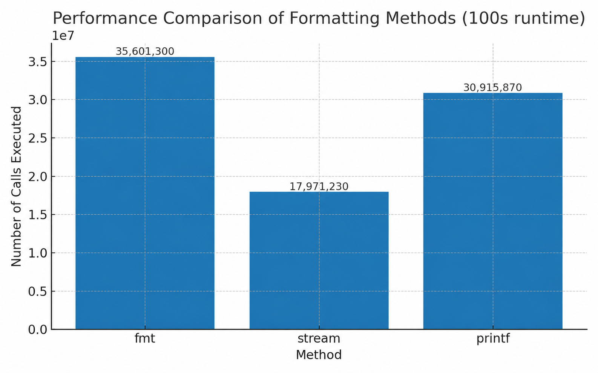

# FMT

fmt is an implementation of std::format / fmt::format like library, but optimized for embedded(and middleware) software
written in C++ programming language on standard C++14.

Main purpose of the fmt is introduce type safety into the log message creation, and also enable creation of boiler plate
log messages for state change in constexpr time, and then in runtime to just log print out the message.


# API

fmt is intended to be easy to use, with just single function call 'fmt::format()'.
call to format function produces an string of fixed size, which is returned to the user as the result
of format operation.

## Usage with trivial types
```
#include <fmt/fmt.hpp>
 
int main()
{
    // runtime;
    int value = 10;
    std::puts(fmt::format("My integer value is {}.", value));
    
    // constexpr value;
    static constexpr auto some_argument = 10u;
    static constexpr auto to_output = fmt::format("My integer value is {}.", some_argument);
    static constexpr auto to_output_string_view = stl::string_view{"My integer value is 10."};
    
    static_assert(to_output == to_output_string_view, ""); // just an example to show that it works at constexpr time
    
    std::puts(to_output); // runtime log
}
```

## Usage with user defined types
```
#include <fmt/fmt.hpp>
 
struct my_complex_type
{
    int         type_one;
    std::string type_two;
    float       type_three;
};
 
namespace fmt {
template<>
struct formatter<my_complex_type>
{
    constexpr fixed_format_string operator()(my_complex_type const& a_value)
    {
        return fixed_format_string{
            "type_one: ",
            a_value.type_one,
            ", type_two: ",
            a_value.type_two,
            ", type_three: ",
            a_value.type_three};
    }
};
 
}  // namespace fmt
 
int main()
{
    my_complex_type type{};
    type.value_one = 10;
    type.value_two = "hello_ten";
    type.value_three = 10.1234f;
    
    std::puts(fmt::format("My type: {}", type));
}
```


# Configuration

As every project has it's own usecase (e.g. some project prints smaller log messages, other one prints bigger ones), library
offers the possibility to cut down printed strings bigger than N characters. This configuration can be configured
during the CMake generation time with setting following variables:

<b>TO_BE_IMPLEMENTED</b>

- <b>MAX_FORMATTING_TOKENS</b> - Indicates how much formatting tokens is available. - Default value is 4
- <b>MAX_SINGLE_STRING_SIZE</b> - Indicates how big single 'format_string' can be. - Default value is 128
- <b>MAX_COMBINED_STRING_SIZE</b> - Indicates how big combined string size can be formatted. - Default value is 512

# Performance

Benchmark compares three different ways of formatting and printing structured data in C++:

1. <b>fmt::format</b>
- Uses your custom fmt formatting engine.
- A formatter specialization for my_complex_type converts the object into a formatted string.
- Each formatted string is printed with std::puts.

2. <b>C++ Streams (std::cout) </b>
- Uses standard stream insertion (<<) to concatenate and print fields.
- This is the canonical way of printing in C++ but often suffers from overhead due to type erasure, synchronization, and formatting.

3. <b>C-style printf </b>
- Uses std::printf with a format string.
- It is typically efficient since formatting is handled in C-style code, but lacks type safety compared to modern alternatives.

## Methodology

- A random dataset of my_complex_type objects is generated.
- Each method runs continuously in a dedicated thread for 100 seconds.
- During this time, each iteration formats and prints every element in the dataset.
- Counters track how many total formatting calls were executed.

## Results

Benchmark results:

<p align="left">
  
</p>
